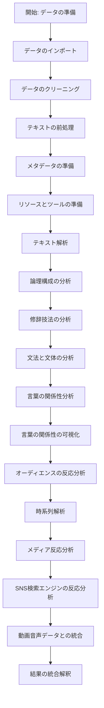
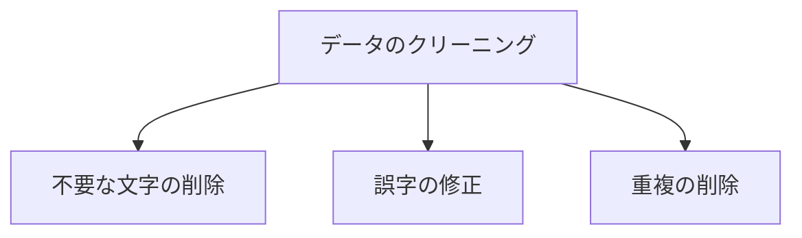

# Text_-Analysis_Charenge

# 全体のフロー

```mermaid
graph TD
    A[開始: データの準備] --> B[データのインポート]
    B --> C[データのクリーニング]
    C --> D[テキストの前処理]
    D --> E[メタデータの準備]
    E --> F[リソースとツールの準備]
    F --> G[テキスト解析]
    G --> H[論理構成の分析]
    H --> I[修辞技法の分析]
    I --> J[文法と文体の分析]
    J --> K[言葉の関係性分析]
    K --> L[言葉の関係性の可視化]
    L --> M[オーディエンスの反応分析]
    M --> N[時系列解析]
    N --> O[メディア反応分析]
    O --> P[SNS検索エンジンの反応分析]
    P --> Q[動画音声データとの統合]
    Q --> R[結果の統合解釈]
```

```mermaid
graph TD
    C[データのクリーニング] --> C1[不要な文字の削除]
    C --> C2[誤字の修正]
    C --> C3[重複の削除]
```

