# Text_-Analysis_Charenge

# 全体のフロー
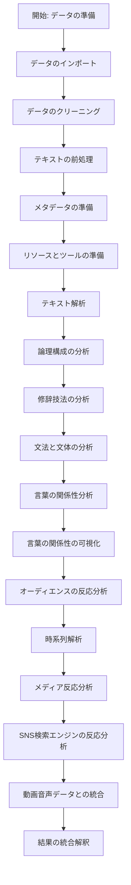

# データのクリーニング
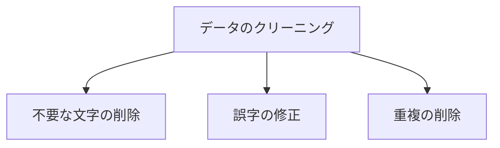

# テキストの前処理
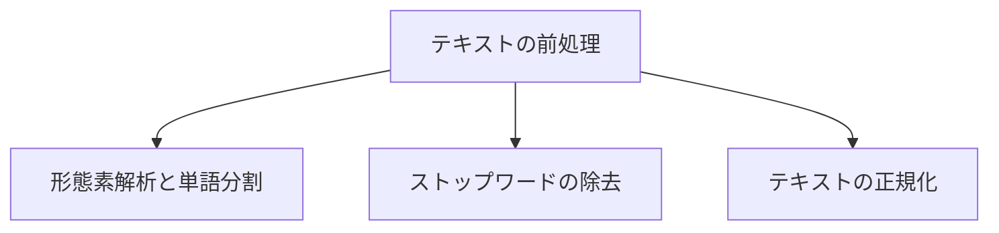

# メタデータの準備
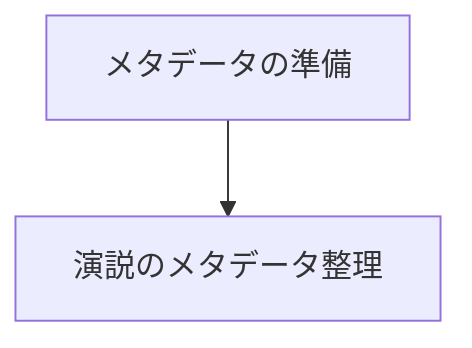

# リソースとツールの準備
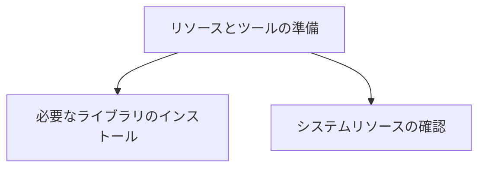

# テキスト解析
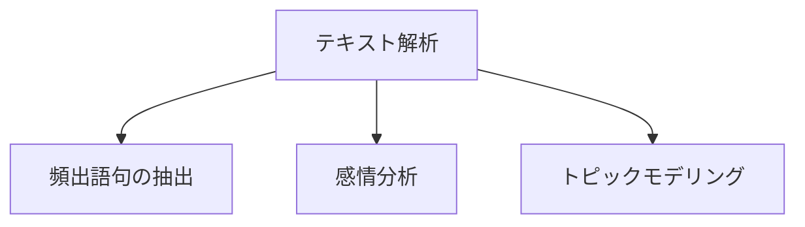

# 修二技法の分析
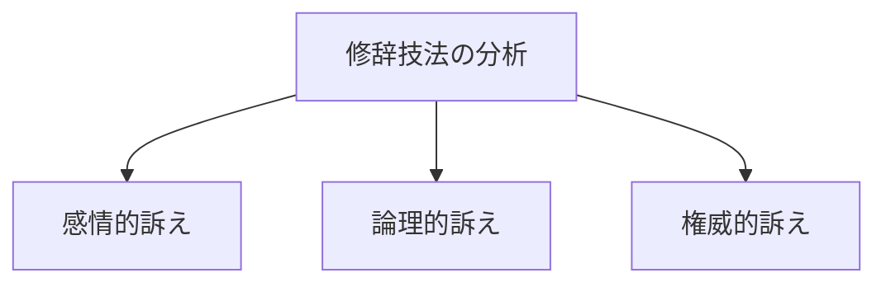

# 文法と文体の分析
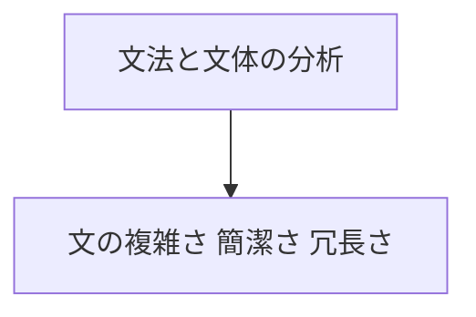

# 言葉の関係性分析
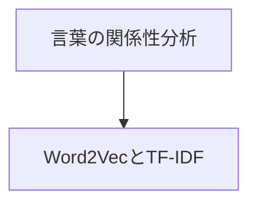

# 言葉の関係性の可視化
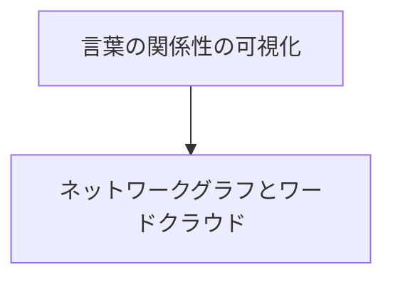

# オーディエンスの反応分析
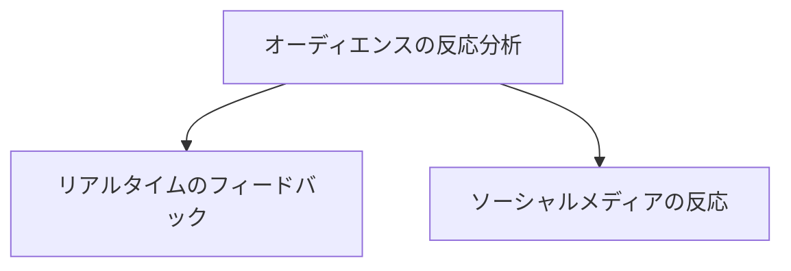

# 時系列解析
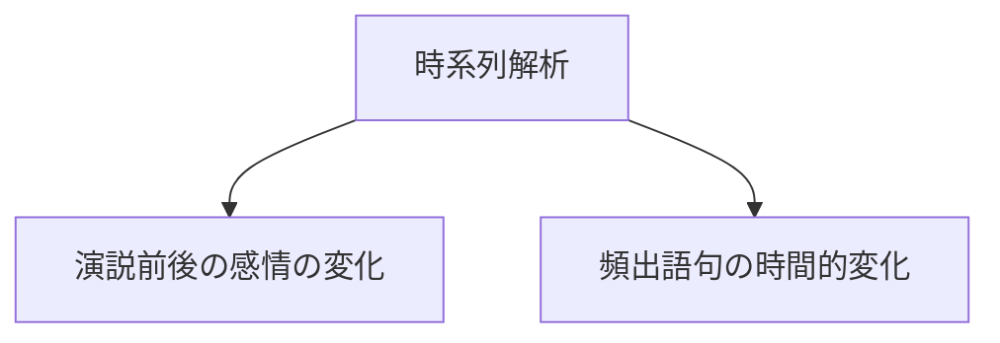

# メディア反応分析
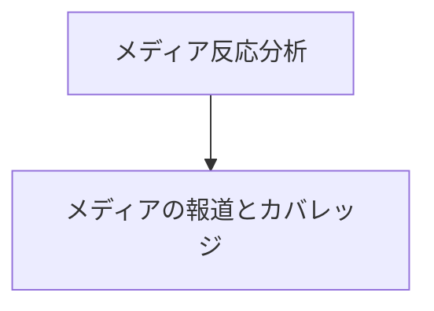

# SNS検索エンジンの反応分析
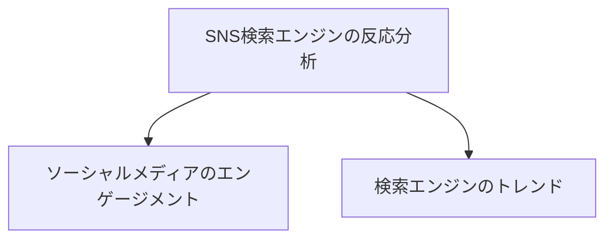

# 動画音声データとの統合
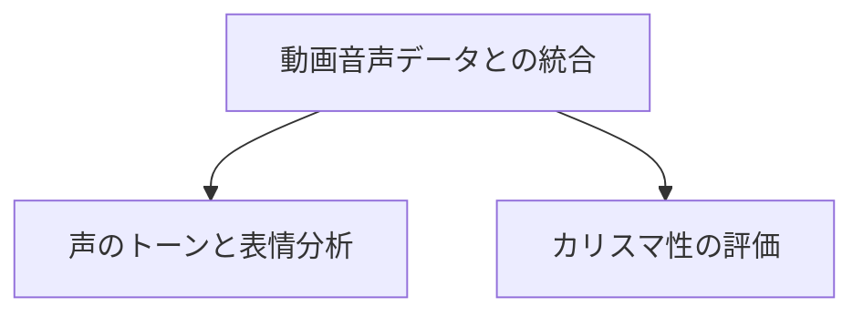
